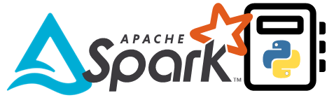

# End-to-end Data Engineering In Azure With Apache Spark

[<< Back to Home Page](/README.md)

## Course Overview

The problem of transforming data to deliver insights to business users hasn’t changed. However, the volume, velocity and variety of data now needing to be handled to achieve those goals has grown exponentially. As a data engineer, we can address that demand with highly scalable, distributed compute and storage, bringing together Apache Spark and the Hadoop Distributed File System (HDFS), now abstracted by many cloud providers and commonly known as our Data Lake or Lakehouse. These cloud native (opensource) resources give us the tools we need to fore fill the business requirements of data transformation, modelling and serving of any inbound datasets. With the ability to also create solid foundations for data science predictive workloads and artificial intelligence.

Using the mature product offering Azure Databricks, we will explore and together code data processing workloads in Python or Scala and Spark SQL to create rich, modelled outputs from dynamic, scalable executions. Once done, we’ll consider porting our Notebooks to other products such as Microsoft Fabric to deliver the same Apache Spark capabilities but wrapped as alternative serverless offerings.

As a new data engineer, or experienced professional looking to enhance your skills, attend this course and leave with everything you need to implement Apache Spark workloads in Azure.

## Objectives

* About the evolution of the distributed compute resource, Apache Spark, and the various software vendor implementations that are now available in the Microsoft cloud.

* How to harness the versatility of Notebooks to develop code in Python, Scala, R or Spark SQL. Including the injection of Markdown to create rich, parameterised, reusable scripts.

* How to structure your data within Data Lake storage using the open-source standard Delta Lake. Looking at the internals for the Delta Table transaction log offering ACID resilience of distributed data processing.

* How to use the power of data frames in Spark to transform large datasets. Using popular libraries and functions to build scalable procedures.

* How to manage your compute clusters in various tools to ensure affective Spark Application execution and the use of Spark Sessions. Including driver and worker node handling of executed code.

* Affective data serving to common endpoints for business user consumption and sharing of data.

* Best practices for using Spark to transform data in production, looking at security, DevOps, and VNet’s.

## Focus Tools
The resources we’ll look at in this course to deliver content, considering a wide breadth and objective scope:

* Azure Databricks
* Microsoft Fabric
* Azure Synapse Analytics
* Azure SQLDB

## Additional Tools
The secondary resources we’ll mention in this course to support primary content:

* Azure Log Analytics
* Azure Key Vault
* Azure Data Lake
* Azure Virtual Networks

# Contact Us
Would you like this course delivered to your team? Reach out to us.

[cloudformations.org/contact](https://www.cloudformations.org/contact)