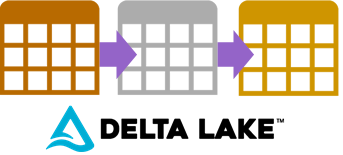

# Creating A Data Lakehouse In The Microsoft Cloud With Delta Lake

[<< Back to Home Page](/README.md)

## Course Overview

The roll and concepts surrounding the humble data warehouse haven’t changed. The technology has just evolved to meet new demands for data at scale. Between our source systems and gaining valuable business insights, we still need something to transform and model that data before it can be consumed.

In this course, we’ll build out a modern data warehouse using modern tools and consider the evolution from Warehouse to Lakehouse. Starting with a simple Azure SQL Database then moving onto Azure Databricks, Azure Data Lake and Microsoft Fabric. Thinking about when our warehouse will outgrow the scaled up relational schema and need a distributed compute approach for affective processing.

We’ll apply industry established extract, transform and load (ETL) concepts to data handling as its cleansed and modelled ready for business user consumption.

## Objectives

* What is the role of a ‘data warehouse’ in a modern analytics platform and how has it evolved to handle ever changing data requirements.

* The importance of dataset transactional resilience in all data processing workloads, regardless of the technology used to implement structured schemas.

* How to extract, transform and load data for reporting using Azure compute and storage resources.

* How to use Delta Lake to structure datasets within Azure Data Lake storage, served using HIVE and queried using Spark SQL.

* How to interpret the internals of a Delta Lake table transaction log. Including check pointing and data optimisation/purging.

* How to build dependency driven workloads for data warehouse processing, considering referential integrity.

* How to scale out ingestion processes to maximise data delivery.

* How to handle surrogate and business keys during data enrichment.

## Focus Tools
The resources we’ll look at in this course to deliver content, considering a wide breadth and objective scope:

* Azure Databricks
* Azure Data Lake
* Microsoft Fabric
* Azure Data Factory
* Azure SQL Database

## Additional Tools
The secondary resources we’ll mention in this course to support primary content:

* Azure Functions App
* Azure Key Vault
* Power BI
* Azure Batch
* Azure Log Analytics

# Contact Us
Would you like this course delivered to your team? Reach out to us.

[cloudformations.org/contact](https://www.cloudformations.org/contact)