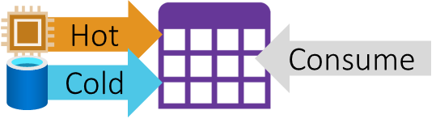

# Compute & Storage 101 – An Engineers Guide To Every Azure Data Resource

[<< Back to Home Page](/README.md)

## Course Overview

The velocity of data is getting faster across many industries, fuelled by the business demand to gain insights and value from sources in near real-time. This necessity is then allowing decision makers to pivot and ultimately stay ahead of the competition. Furthermore, the growth of the internet of things and ‘smart’ devices now means the volume of that high velocity data has exploded. Meeting this demand requires new concepts and new designs for data/solution architects, with high throughput ingestion endpoints and query stream tools that can perform aggregations ‘on the fly’. 

In this course, we will address the above head on. Discussing and designing architectures that can scale and burst for high throughput events. Querying using both SQL and KQL to blend stream and batch data feeds for downstream reporting.

As a platform, we’ll use Azure Event Hub and Azure Stream Analytics to ingest and handle that initial data stream. Before applying the same patterns to other resources in Microsoft Fabric and Azure Data Explorer. Understanding the patterns to apply as an architect vs the tooling available for delivery.

## Objectives

* The theory and history behind lambda and kappa architecture design patterns.

* The role of structured and semi-structured data as part of end-to-end solution data flows.

* How technology has evolved to simplify our designs when handling data at any velocity. Looking at the use of Spark Streaming jobs and Delta Lake tables to deliver kappa design patterns at scale.

* What ingestion resources are needed for both batch and stream data handling.

* How to combine batch and stream datasets into a comprehensive data model, supporting the serving of both source input types.

* Maintaining data integrity across all data outputs and the summarisation of stream data now enriched with batch updates.

* Aggregating streaming datasets using sliding, hoping and tumbling compute windows.

* How to create a common serving endpoint for business users.

## Focus Tools
The resources we’ll look at in this course to deliver content, considering a wide breadth and objective scope:

* Azure Event Hub
* Azure Stream Analytics
* Microsoft Fabric
* Azure Databricks

## Additional Tools
The secondary resources we’ll mention in this course to support primary content:

* Azure Data Explorer
* Azure Storage
* Azure IoT Hub
* Power BI

# Contact Us
Would you like this course delivered to your team? Reach out to us.

[cloudformations.org/contact](https://www.cloudformations.org/contact)