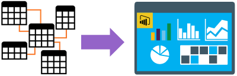

# Practical Data Modelling And Serving – Converting Business Events Into Insights

[<< Back to Home Page](/README.md)

## Course Overview

Often business reporting is done based on the input data available from the different source systems available. This approach is wrong. In this course, we’ll take an output focused approach to capturing business events and metrics before turning those requirements into a source system agnostic data model. A logical data model that clearly represents the business functions, defined using business glossary terms. Once created, a new reporting/semantic layer can be forged using industry established star schema definitions, that ultimately allows any business user to explore and self-serve on the data products created.

Using techniques such as Business Event Analysis Modelling (BEAM), Kimble and Inmon data warehousing we’ll unlock value for the business, reverse engineering required outputs to available source system inputs. Delivered using an Azure SQL Database and Azure Analysis Services for data modelling, then reporting in Power BI, we’ll create an OLAP data schema that can be used with upstream data mappings and defined as a rich entity diagram. Every business needs this foundational data modelling support to apply governance, unlock valuable insights and later, delivery AI use cases.

## Objectives

* The differences between online transactional and analytical dataset in terms of structure and handling.

* How to structure and define data models using a range of skills and techniques, following an output driven approach to capture business requirements.

* How to build and define tables as facts and dimensions for reporting. Including different grains of fact table and different types of dimensions to capture changing attribute values over time.

* How to create aggregated queries using a comprehensive data model to slice and dice outputs.

* How to serve modelled data through SQL endpoints to downstream business user reporting tools. Available in various serverless forms.

* Consuming modelled data using Power BI to create calculated metrics, KPI’s can contextual aggregated values.

* How to deliver a semantic presentation layer for business users with a view of how those models of loaded or granted direct query access to the underlying data store. 

* How to write calculations in DAX and M to support reporting outputs in Power BI.

## Focus Tools
The resources we’ll look at in this course to deliver content, considering a wide breadth and objective scope:

* Azure SQL Database
* Azure Analysis Services
* Power BI
* Microsoft Fabric

## Additional Tools
The secondary resources we’ll mention in this course to support primary content:

* Azure Data Factory
* Azure Databricks
* Azure Data Lake
* Microsoft Purview

# Contact Us
Would you like this course delivered to your team? Reach out to us.

[cloudformations.org/contact](https://www.cloudformations.org/contact)