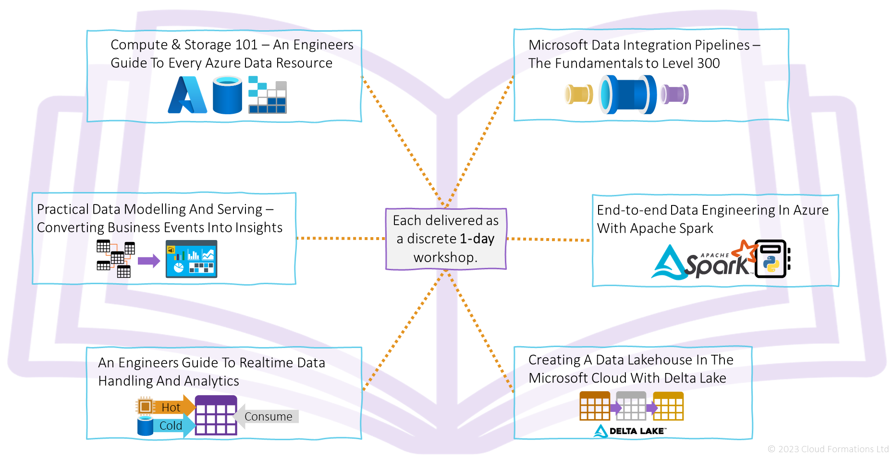

Cloud Formations Ltd
Website: [cloudformations.org](https://www.cloudformations.org/)
Email: [contactus@cloudformations.org](mailto:contactus@cloudformations.org)
Phone: +44 (0) 3332 423 195
___

## Data Engineering Catalogue

1. Compute & Storage 101 – An Engineers Guide To Every Azure Data Resource. [More details >>](1.%20Compute%20&%20Storage%20101%20–%20An%20Engineers%20Guide%20To%20Every%20Azure%20Data%20Resource/Overview.md)

2. Microsoft Data Integration Pipelines – The Fundamentals to Level 300. [More details >>](2.%20Microsoft%20Data%20Integration%20Pipelines%20–%20The%20Fundamentals%20to%20Level%20300/Overview.md)

3. End-to-end Data Engineering In Azure With Apache Spark. [More details >>](3.%20End-to-end%20Data%20Engineering%20In%20Azure%20With%20Apache%20Spark/Overview.md)

4. Creating A Data Lakehouse In The Microsoft Cloud With Delta Lake. [More details >>](3.%20End-to-end%20Data%20Engineering%20In%20Azure%20With%20Apache%20Spark/Overview.md)

5. An Engineers Guide To Realtime Data Handling And Analytics. [More details >>](4.%20Creating%20A%20Data%20Lakehouse%20In%20The%20Microsoft%20Cloud%20With%20Delta%20Lake/Overview.md)

6. Practical Data Modelling And Serving – Converting Business Events Into Insights. [More details >>](6.%20Practical%20Data%20Modelling%20And%20Serving%20–%20Converting%20Business%20Events%20Into%20Insights/Overview.md)

___

## Technology Catalogue

7. Getting Started with Microsoft Fabric - Learn By Doing. [More details >>](7.%20Getting%20Started%20with%20Microsoft%20Fabric%20-%20Learn%20by%20Doing/Overview.md)

___